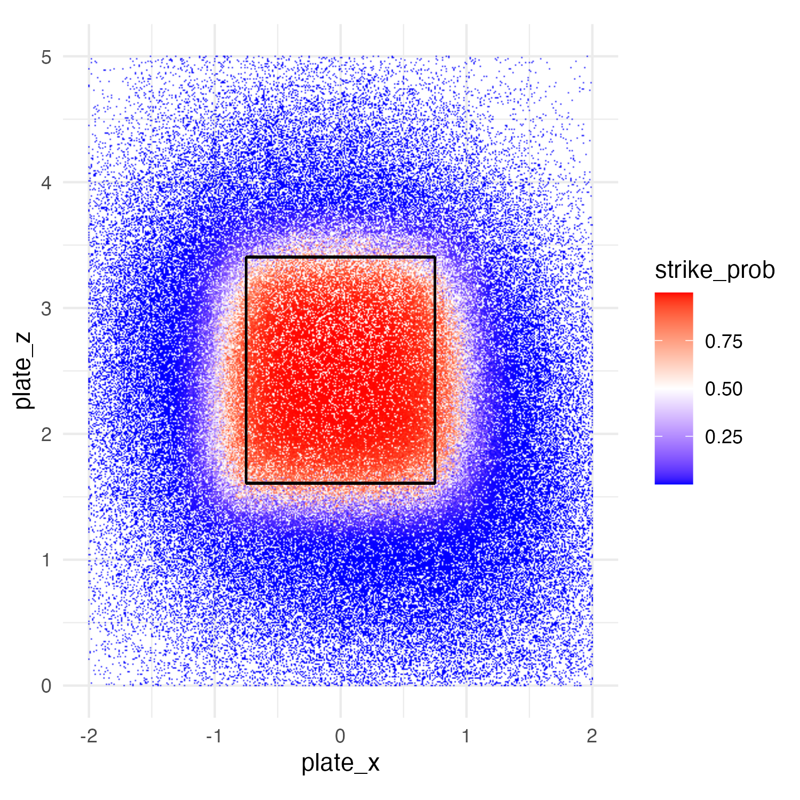

# MLB Strike Zone Prediction & Catcher Receiving Analysis

**Predicting called strike probability using Statcast data to quantify the actual MLB strike zone and evaluate catcher framing performance.**

## Overview

This project builds a predictive model to estimate the probability of any pitch being called a strike, using detailed pitch tracking data from MLB's Statcast system. By modeling umpire behavior rather than the rulebook strike zone, we can identify the *actual* strike zone and quantify how effectively catchers "frame" borderline pitches.

**Key Results:**
- **Model Performance**: 0.982 AUC on called strike prediction
- **Practical Application**: Comprehensive catcher receiving scores for all 2021 MLB catchers
- **Insights**: Visualized strike zone boundaries that differ significantly from the official rulebook definition

## Business Value

Understanding catcher framing has become crucial in modern baseball analytics. Elite framing catchers can add over 100 strikes per season by influencing umpire calls on borderline pitches. This analysis provides:

- Objective measurement of catcher framing ability
- Data-driven insights into actual vs. theoretical strike zones
- Framework for evaluating defensive value beyond traditional metrics

## Methodology

### Data Collection
- **Source**: MLB Statcast data via `baseballr` R package
- **Scope**: All called pitches (balls and strikes) with complete tracking data
- **Features**: Pitch location (x, y, z coordinates), velocity, spin rate, catcher identity, umpire, count, batter handedness

### Model Development
- **Algorithm**: xgboost
- **Target Variable**: Called strike (1) vs. called ball (0)
- **Validation**: train/test split, cross-validation
- **Performance**: 0.982 AUC demonstrates excellent predictive capability

### Catcher Scoring
Catcher receiving scores calculated by comparing:
- Expected strike probability (model prediction) vs. actual umpire call
- Aggregate performance across all borderline pitches caught
- Adjustment for season (100-game) scoring

## Model Performance

| Metric | Value | Interpretation |
|--------|-------|---------------|
| ROC AUC | 0.983 | Exceptional discrimination ability |
| Log Loss | 0.159 | Highly calibrated probabilities |
| Precision | 95.0% | Low false positive rate |



*Predicted strike zone boundaries show clear differences from rulebook definition*

## Key Findings

- The actual MLB strike zone differs substantially from the rulebook definition
- Top-tier framing catchers can greatly influence more borderline calls in their favor
- Strike zone consistency varies significantly by pitcher and batter handedness

## Technologies Used

- **R** - Primary analysis language
- **baseballr** - Statcast data acquisition and MLB data access
- **tidyverse** - Data manipulation and cleaning (dplyr, tidyr, readr)
- **ggplot2** - Data visualization
- **tidymodels** - Machine learning workflow and model validation framework

## Getting Started

### Prerequisites
```r
install.packages(c("baseballr", "tidyverse", "tidymodels", "DBI", "RPostgreSQL", "RPostgres", "data.table", "ggplot2", "xgboost"))
```

### Usage
1. **Data Collection**: Run scripts in `Data/` folder to pull and save latest Statcast data
2. **Model Training**: Execute modeling pipeline in `Modeling/` folder
3. **Generate Scores**: Use trained model to score catchers via `Scoring/` scripts
4. **Visualize Results**: Create strike zone plots using `Visualizations/` code

## Results Preview

The final model achieves exceptional predictive performance (AUC = 0.982) and reveals nuanced patterns in umpire decision-making. Catcher receiving scores for 2021 are available in `Scoring/2021_catcher_receiving_scores.csv`.
